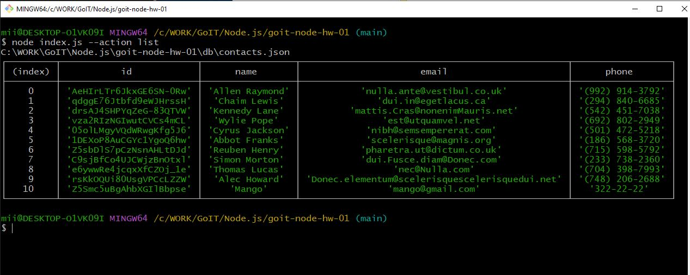
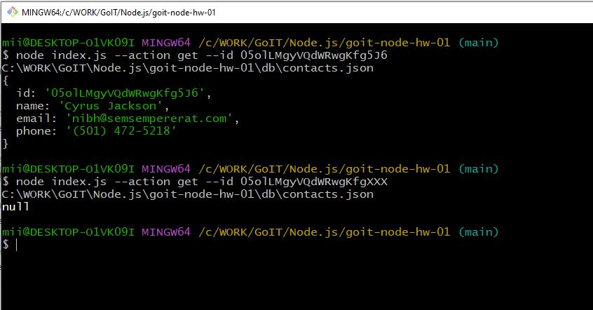
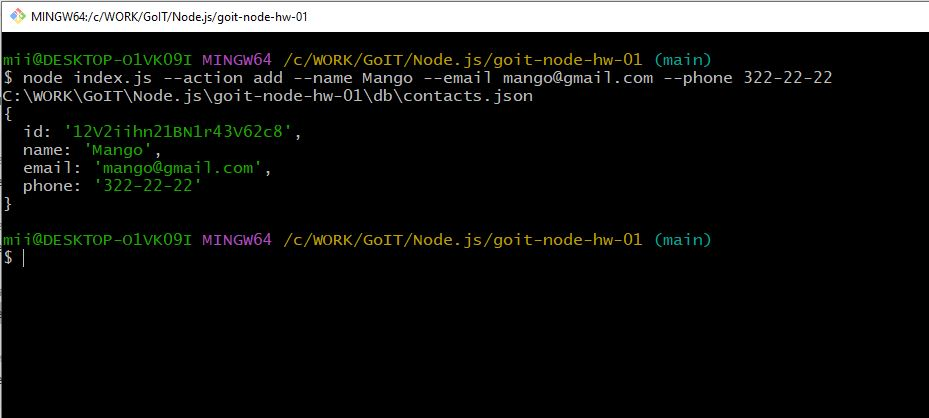
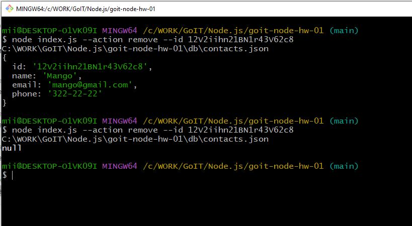

# goit-node-hw-01

### Receive and display the entire list of contacts in the form of a table (console.table)
node index.js --action list  

### Receive a contact by id - output the contact object to the console or null if a contact with such id does not exist.
node index.js --action get --id 05olLMgyVQdWRwgKfg5J6  

### Add a contact and display the created contact in the console
node index.js --action add --name Mango --email mango@gmail.com --phone 322-22-22  

### Delete the contact and display the deleted contact or null in the console if a contact with this id does not exist.
node index.js --action remove --id 12V2iihn21BN1r43V62c8  

